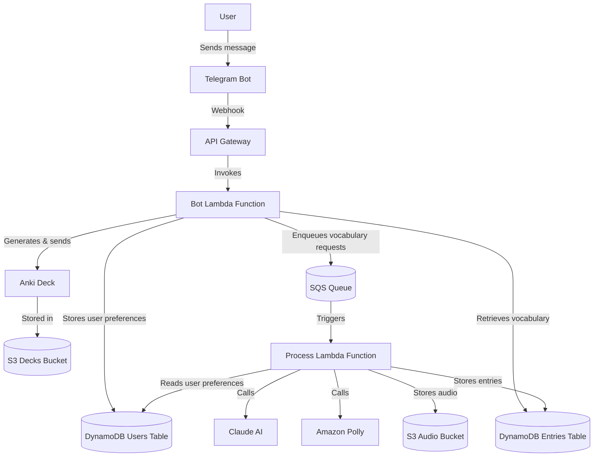

# AnkiBot - Telegram Language Learning Assistant

🤖⚠️ This is an experimental project to explore Cursor capabilities. All of the code and this README were generated with only minor manual one-time fixes like string formatting or adding emojis.

Almost pure vibe coding experience.

## Overview

AnkiBot is a Telegram bot designed to help users learn German vocabulary through personalized examples and Anki flashcard integration. The bot allows users to send German words or phrases, and it responds with definitions, translations, and contextual examples tailored to the user's language level and learning context.

## Features

- **Vocabulary Learning**: Send any German word or phrase to get definitions and translations
- **Personalized Examples**: Examples are tailored to your language level (A1-C2) and learning context
- **Anki Integration**: Export your vocabulary collection as an Anki deck for spaced repetition learning
- **Audio Pronunciation**: Audio files for words and example sentences are automatically generated
- **Multilingual Interface**: Supports both English and Russian interfaces
- **Customizable Learning**: Set your language level and learning context to personalize the experience

## Commands

- `/help` - Show available commands
- `/export` - Export your vocabulary as an Anki deck
- `/list` - Show all saved words and phrases
- `/level` - Set or view your language level (A1-C2)
- `/context` - Set or view your learning context

## Architecture

AnkiBot is built on AWS serverless architecture:

- **AWS Lambda**: Handles bot commands and processes vocabulary requests
- **Amazon DynamoDB**: Stores vocabulary entries and user preferences
- **Amazon SQS**: Queues vocabulary requests for asynchronous processing
- **Amazon S3**: Stores audio files and Anki decks
- **Amazon API Gateway**: Provides webhook endpoint for Telegram
- **Amazon Polly**: Generates audio pronunciations
- **Anthropic Claude**: Provides AI-powered language assistance

### Architecture Diagram



## Technical Components

- **bot.py**: Handles Telegram webhook and user commands
- **process.py**: Processes vocabulary requests using Claude AI
- **core.py**: Contains data models and database interactions
- **anki.py**: Generates Anki decks from vocabulary entries
- **localization.py**: Handles multilingual support
- **messages.yml**: Contains localized messages

## Deployment

The application is deployed using AWS CloudFormation:

1. Package the Lambda functions and dependencies:
   ```
   ./build.sh
   ```

2. Deploy the CloudFormation stack:
   ```
   aws cloudformation deploy \
     --template-file template.yaml \
     --stack-name ankibot \
     --parameter-overrides \
       TelegramToken=YOUR_TELEGRAM_TOKEN \
       AnthropicApiKey=YOUR_ANTHROPIC_API_KEY \
       DeploymentBucket=ankibot-deployment \
       CodeVersionHash=$(date +%s) \
     --capabilities CAPABILITY_NAMED_IAM
   ```

3. Set the webhook URL in Telegram:
   ```
   curl -X POST https://api.telegram.org/bot${TELEGRAM_TOKEN}/setWebhook \
     -H "Content-Type: application/json" \
     -d '{"url": "YOUR_WEBHOOK_URL"}'
   ```

## User Flow

1. User sends a German word or phrase to the bot
2. Bot acknowledges receipt and queues the request
3. Process function retrieves user preferences (level, context)
4. Claude AI generates definitions, translations, and examples
5. Audio files are generated for the word and examples
6. Entry is saved to DynamoDB
7. User can view their collection with `/list` or export it with `/export`

## Customization

Users can customize their learning experience:

- **Language Level**: Set your CEFR level (A1-C2) with `/level [level]`
- **Learning Context**: Set your learning context with `/context [context]`
  - Example: `/context Business German for finance industry`
  - Example: `/context Traveling to Berlin next month`

## Development

To set up a local development environment:

1. Clone the repository:
   ```
   git clone https://github.com/yourusername/ankibot.git
   cd ankibot
   ```

2. Create a virtual environment:
   ```
   python -m venv venv
   source venv/bin/activate  # On Windows: venv\Scripts\activate
   ```

3. Install dependencies:
   ```
   pip install -r requirements.txt
   ```

4. Set environment variables:
   ```
   export TELEGRAM_TOKEN=your_telegram_token
   export ANTHROPIC_API_KEY=your_anthropic_api_key
   ```

5. Run tests:
   ```
   pytest
   ```

## License

This project is licensed under the MIT License - see the LICENSE file for details.

## Acknowledgments

- [python-telegram-bot](https://github.com/python-telegram-bot/python-telegram-bot) for the Telegram API wrapper
- [Anthropic Claude](https://www.anthropic.com/claude) for AI language assistance
- [genanki](https://github.com/kerrickstaley/genanki) for Anki deck generation
- [AWS Serverless](https://aws.amazon.com/serverless/) for the cloud infrastructure
